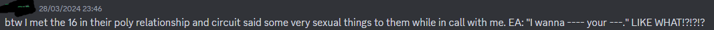
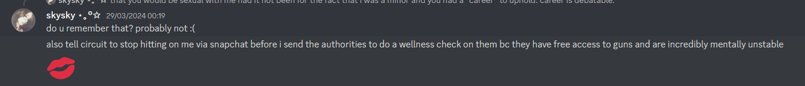

# The Fezichive
##### Although this is attached to the Alex Rayner name, it wasn't written by me; it was written by the lovely Un Simp and the opinions expressed by Un are of their own thought, not mine -Alex Rayner

#### Transcription of all images will be shown in alt text [^1]
#### out of respect some names have been censored
# DO NOT SEND ANY HARRASMENT TO ANYONE INVOLVED HERE, HARRASMENT GETS NOTHING DONE
## The Start
On the 20th of June 2023, good friend and current Juroze member Skyla, posted a message to the Feziboy discord server concerning their relationship when Sky [^2] was only 16 and Fez into their 20's

> Hey everyone ! I know a lot of you know who I am so I hope that you all are aware that I am doing this for the greater good and safety of everybody here. If you are upset with me after this or do not agree with this, please let me know in DMS as they will be open. Other than that, after this is said and done, I will be leaving this server. When I was 16 and Fez was 20, I was invited to be in a polyamorous relationship with him and Circuit (also an adult). Obviously this would mean that Fez, a 20 yr old grown man had romantic/sexual feelings towards me, a 16 yr old child. Although I declined this offer, some time afterwards another person was added to the relationship. Another 16 yr old. They are still in this relationship, being actively groomed by 2 adults. I sincerely hope that they see the problem with this soon and can heal from the reality of being taken advantage of by people who are grown and should know better. Circuit themselves is also not an upstanding person. Extremely manipulative, guilt trips with very triggering topics (namely su!c!de), and even smaller things such as stealing art and abusing their power as admin and one of Fez’s partners. Everything that has been gathered on them will be in the screenshots shared below. Thank you all for some very fun memories and I hope there can still be peace within this server and within my friendships with people I’ve met through this server.

Attached to this message was a screenshot of a google doc that is now called "The Circuit Files" 

*the next attachment to this webpage uses iframe objects, if your browser does not support these please view the full page [here](cicuit/CopyofTheCircuitFilesJune202023234AM.html)*
<iframe src="cicuit/CopyofTheCircuitFilesJune202023234AM.html" style="height: 200px; width:100%"></iframe>

Fezi responds to this with only two words.

Around half an hour later Fezi posts a response into general

At 18:57 Fezi messages his [^3] now ex-partner Circuit and proceeds to then publish this image alongside another message at 19:19 [^4]

 

At 20:07 UTC, Sky messages Circuit, concerned about =====  (who joined Fez and Circut's Poly relationship after Sky left)
 

Circuit blocked Sky shortly after this.
## The Next Day
On the 21st of june 2023, =====, removed all the messages from the event and posts a message about how Fez did not groom them

Fezi posts a message about not harassing Circuit about their actions later that night

Questbound (Fay) had messaged Fezi ealier asking "do you ever see yourself comming back" and Fez responded

 After this Aaron Matthews messages Fez calling him out for lack of accountability

Aaron Matthews full statement of the case (sorry i just finished a jekyll and hyde essay)

<video width="320" height="" controls>
  <source src="TND/untitled.mp4" type="video/mp4">
</video>

Fezi then responds

And also a note to whoever is reading this and you have autism. NEVER PULL THE AUTISM CARD IN A SITUATION LIKE THIS YOU CANNOT USE IT IN THIS SITUATION

Fezi then attempts to justify the removal of the last 2 days of conversation

Fay being the based person they are call out fez on their bullshit

 

## The Aaron Convos

meanwhile, Aaron proceeds to drop a 150kg nuke in Fezi's dms about how he keep on deflecting and playing the victim

 

Circuit rejoins the server not too long later

 2 days later, Fez shares this conversation with Aaron

> Shit \ he actually got it spot on here to be fair - Aaron

But you know somehow Fez fucks this up 

<audio width="320" height="" controls>
  <source src="AC/idk.mp3" type="audio/mp3">
</audio>

*Due to the contents of this audio file, it has been classed, grade A cognitohazard. Foundation personel should only listen after being innoculated with DeezCringe-VjC-K2 hazard prevention drug*

>Aaron said when sharing: "bro i’m cringing he just lost everything he built up from that message"
and "this is physically painful to listen to"

couldn't of said it better myself

did no one learn anything from the colleen ballinger video

> i actually think fez should of covered toxic gossip train i think that would have been better than whatever the fuck that mp3 is

## Fezi announces a new rule and its stupid as fuck

In the evening, Fezi creates a new role essentially banning minors from the server and requiring  verification.

For those who had not verified yet, the server looked like this

A new general chat is created for the server

Fez states that he had to remove all minors from the server and says that people who care about his content would follow the new rules

At this point most of the server's channels are still privated to 18+ however general is still open to anyone who joins

Fezi also adds to this in #rules asking for proof of age and a photo.

On the 24th, Fezi sends DMs between him and Skyla (from may 20th 2022) to Aaron while **literally admitting to being attracted to Sky in the process**

 [^5]

Fezi goes on to say that he only said he was attracted to help her due to her "vulnerability" at the time

Fez had also admitted before-hand that he would of had a sexual relationship with Sky if it wasn't for Circuit and the fact Sky was under 18 [^6]

[^7] [^11]

Fezi claims that the reason the new rule have been implemented is due to him not wanting this to happen again.

 

 > however this could easily not happen again IF YOU JUST DONT TRY TO DATE CHILDREN ITS REALLY NOT THAT HARD GUYS

later on, the entire server gets purged and reset 

## Apology

On the 2nd of July 2023, (around 9 days since the last event) this video is uploaded to the Feziboy youtube channel

<video width="320" height="" controls>
  <source src="apology/apology.mp4" type="video/mp4">
</video>

Alex responds to this saying that Fezi definitely did not learn as he had then dated another 16 year old after this interaction

  [^7]

Fezi messages this to Aaron about how Cicuit affected him [^8]

  [^9]

On the 19th, Fez messages Aaron about how the situation has affected him

  

On the 25th, Fez makes another request for people to stop calling him a pedo

This was reposted into the Circuit Files (as it was public edit at the time)

>But onna fr note I just wish he'd stop making an announcement and just dip from the internet for a bit for his mental health and everyone involved in the situation him having an announcement every other day isn't helping anything and it's actively creating more discourse

around a month later, (we are unsure of the date of the event) the server is deleted.

the situation stayed calm for around 7 months or so apart from the odd message in Oliver Tree's discord... until....

## 2024 FEZI EXPOSURE 2 ELECTRIC BOOGALOO

On the 17th March 2024, Alex posts this tiktok replying to one of Fezi's old comments

<video width="320" height="" controls>
  <source src="FE2EB/tiktok_lilbamabeets_7347441877991394592.mp4" type="video/mp4">
</video>

Fezi responds trying to defend himself

  

> The archive discord had fun with this
> 
> 

on the 20th, Alex responds to Fezi with this video 

<video width="320" height="" controls>
  <source src="FE2EB/tiktok_lilbamabeets_7349709338388319520.mp4" type="video/mp4">
</video>

The next day, Fezi messages Fay with this message

>Skyla had a lot of problems with relationships and self image and, because I feel the need to make people happy all the time, it's landed me into a lot of terrible situations I regret to this day, and I've been trying to accept that I can't change the past, I tried to apologise like this before and move on with my life instead agonising about tis all the time. 
>
>She turned to me because I have the tendency to comfort those in distress, so much so that I contradict my actual beliefs and values, just to make everyone happy.
>
>She came to me saying no one finds her attractive, I didn't want her to think she was ugly, so I told her she is attractive. I am not attracted to her, but people perceiving themselves as ugly upsets me. It was horrible attempt and it hurts to think about the fact that actually happened. I would say anything just to give her the sense that she is worthy.
>
>I understand the overall implication was wrong and I wasn't thinking about the overall effect of that statement. I am not sexually or romantically attracted to her, I was just a friend trying to comfort another friend in a way that was incredibly detached from reality.
>
>My intentions were always to make everyone happy and I didn't always have the best method of doing so and I regret that every day, but my intentions were always pure. I know I can't prove that. But I know that's the case and it upsets me that I've caused this amount of damage and it's been haunting me with intrusive thoughts of people thinking I'm attracted to minors when I'm not
>
>I literally avoid interacting with kids in any way because of this, and I don't hate the way I interacted with her and I'm now understandably perceived as a threat, and I've become very isolated as a result.
>
>I always regret how I went about dealing with Skyla and tell this to my close friends whenever it comes up. It pains me that people see me as a predator of sorts and I understand why people see me
that way and are upset about my
actions. I'm not happy with me. I
feel terrible whenever anyone
brings it up. I never want to cause
conflict to anyone and I'm sorry
for my shitty behaviour.
>
>I just need you to understand, I
am not attracted to minors. That
is disgusting in every sense. But
no matter what I do, I can't
change people's minds about me
and, as I'm getting to the end of
writing this, I want to come to
terms with that.
>
>*I hate the way I interacted with
her
>
>Is what I meant

On the 28th, Sky posts this TikTok explaining everything

<video width="320" height="" controls>
  <source src="FE2EB/tiktok_mcskittlezzz_7351560482270088490.mp4" type="video/mp4">
</video>

We then discover that Fezi has a new discord server (created 25th Feburary at 20:30)

**the next images are taken from a [chat export](feziserv28/FeziCord%20-%20Text%20Channels%20-%20💬general%20[1211444875984379964]%20(after%202024-03-28).html) I created shortly before starting this document**

Fezi says that the reason he isn't allowed in Oliver Tree servers is due to "misinformation"

  

In the archive server we are also told about Circuit and how weird they are  
  [^6]

Sky joins the discord and starts calling Fez out again

We are also told (in the TikTok) and the discord that Circuit is continually attempting to message Sky and snap them.

Fezi attempted to use the conversation with Fay to get out of it. Then Fay shares her full response

  

  

>remember when fez locked their old server to 18+ to protect minors like who was he protecting them from?? himself?? the only reason that happened is cos fez was called out

Fez keeps on trying to play the victim

  

  

## The rest of the server gets involved (YAY)

So bama does the genius thing and pings everyone

  

A few people try to defend him but we are able to shut them down easily
  

The screen shot is the insta dms that Fez admitted to being attracted to Sky

For some reason when another member pings everyone alongside us, the head mod stops them

  

this person also asks people to stop calling Fez a pedo because "its in the past"

  

This person is also 15 so probably dosen't know the full extent of what happened as Fezi did purge the previous server.

Sky and Alex were both banned shortly after.

Followed by Fay and myself

> never fucking delete this un.

## Oliver Tree fans come to the rescue

For those unaware, Fezi was a member of the Oliver Tree community and his music style is very much similar to Oliver. He frequently uses leaked stems and demo songs and proceeded to release them (which is not only illegal [^10] but also really wrong)

Most people in the community already knew already about what happened last time but we decided to make it more public.

On the 29th. Sky posted a discord message into Oliver Tree's discord sharing the TikTok video 

  

We also get confirmation that Oliver does not own the "Mr. Tree" spotify account

  

The mods offer to pin Sky's post on Reddit and she does

  

A short while later...
  

The full reddit post is available [here](https://www.reddit.com/r/olivertree/comments/1bqfo62/feziboy_a_creator_with_a_decent_following_in_the/)

> To this mod. Thank you so fucking much
## Outro

  

## Acknowledgements

Thank you to Alex Rayner, Aaron Matthews, Fay and Robyn for collecting this data

Thank you Alex specifically for creating the Fezichive initially

**and thank you to Skyla for being comfortable enough to come out with this** 

*A fine release by Un_Simp*

[^1]: All transcripts are [[sic]](https://en.wikipedia.org/wiki/Sic) apart from some situations where the OCR fucked up and I corrected it
[^2]: not to be confused with [Sky UK Limited](https://en.wikipedia.org/wiki/Sky_UK)
[^3]: Fezi uses They/Him pronouns, this post uses "He/Him" for consistency
[^4]: Out of respect for the person mentioned here, (and as they are still a minor afaik) I have censored their name.
[^5]: Fezi currently lives in the UK which is why he says he will travel to America
[^6]: The proof for this is quite lacking due to this happening over discord VC
[^7]: This image was originally two that I have condensed into one to reduce data transfer on my server
[^8]: This image is from an extract of a video available [here](apology/aaronfullconvo.mp4)
[^9]: "fucking Oliver Tree fans think i'm a pedo." this was due to some messages being posted on the Oliver Tree discord about Fezi and the mods ran with it  
[^10]: [https://www.legislation.gov.uk/uksi/1995/3297/regulation/6/made](https://www.legislation.gov.uk/uksi/1995/3297/regulation/6/made)
[^11]: "Gru From dispicable me" is Alex's nickname for Sky

  <!-- Butoons -->
      
      
      
      
      
      
      
      
      
      
      
      
      
      

